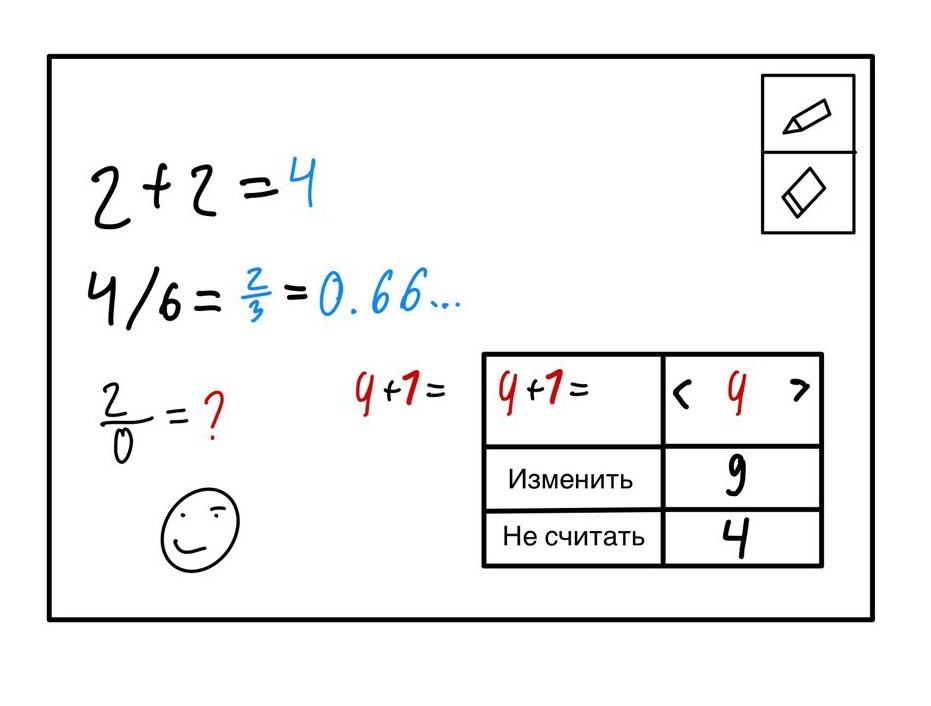
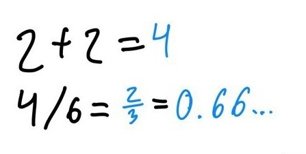
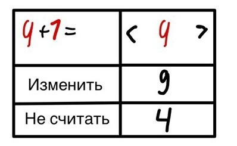
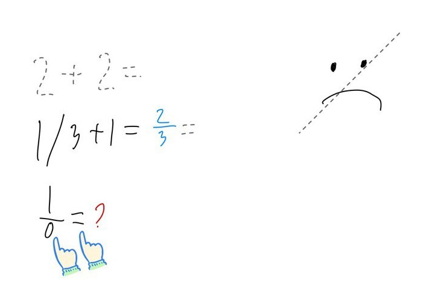

# Концепция UI для "Умного калькулятора"

## Терминология
### Холст
* Пространство, предназначенное для написания текста.
* Ограничено только сверху и слева.

### Текст
* Весь рукописный ввод пользователя.
* Не обязательно представляет собой набор текстовых символов.
* Не обязательно является выражением.
* Выражение - это часть текста.

### Выражение
* Часть текста, распознанная как задание пользователя.
* Выражение содержит знак **равно** и делится на **левую** и **правую** части.
* Правая часть выражения не включает пользовательский ввод.
* Выражения не могут пересекаться, за исключением случаев, когда правая часть одного выражения **является** левой частью другого.
* На любое выражение можно нажать, чтобы открыть меню выражения.

### Меню выражения
* Открывается двойным нажатием на выражение (или одинарным, если подключен стилус).
* Представляет собой всплывающее окно.
* В меню отображается текст распознанного выражения.
* Также из меню можно отменить распознавание, после чего выражение становится обычным текстом и игнорируется до его изменения.
* В меню доступны и другие действия, описанные ниже.

## Внешний вид приложения
* Холст можно увеличивать, уменьшать и перемещать двумя пальцами.
* Если подключен стилус, холст можно перемещать и одним пальцем.
* **Панель инструментов** - это плавающее окно, которое магнитится к краю экрана и при необходимости сворачивается к нему. Привязана к краю экрана.
* На панели инструментов доступны два инструмента: ручка и ластик.
* Меню - всплывающее окно, привязанное к выражению. Оно содержит текст выражения с кнопками под ним. Меню можно открыть двойным тапом при отключенном стилусе или одинарным при подключенном.

## FAQ

### Как пользователь инициирует расчет?
* Пользователь пишет текст на экране планшета с помощью стилуса или пальца.
* Математическое выражение распознается как текст слева от знака равно, но не слишком далеко, чтобы не задевать лишний текст.
* Через одну секунду после распознавания знака равно, если не были внесены новые изменения, начинается распознавание и вычисление выражения.
* Если справа, недалеко от знака равно, есть текст, то выражение считается невалидным, и система информирует пользователя о [невозможности выполнить расчет](#как-система-информирует-о-невозможности-выполнить-расчет).

### Где и как система отображает результаты вычисления?
* Результат отображается справа от знака равно, являющегося самым правым знаком выражения. Цвет результата контрастирует с цветом рукописного ввода.
* Результат отображается рукописным шрифтом, размером, соответствующим среднему размеру текста пользователя, или, для дробей, минимальным между ним и половиной высоты выражения.
* Если результат невозможно представить в виде десятичной дроби, но возможно в виде несократимой обычной или смешанной дроби, то он отображается именно так:  
  $\frac{1}{3} + 1 = \frac{2}{3}$.
* Если выражение является несократимой обычной или смешанной дробью, то результат представляется в виде десятичной дроби:  
  $\frac{2}{3} = 0.666...$.

### Как система информирует о невозможности выполнить расчет?
* Если система не может распознать выражение, нераспознанные части окрашиваются в цвет, контрастный к цвету текста и результата.
* Если в выражении есть математическая ошибка (например, деление на ноль), система выводит "?" того же контрастного цвета.

### Как система облегчает устранение «ошибок»?
* Пользователь может стереть или исправить ошибочную часть.
* В меню выражения доступно текстовое редактирование. Если оно используется, весь рукописный ввод выражения заменяется на аналогичный текст, написанный рукописным шрифтом.
* (Опционально) В меню выражения AI-помощник предлагает несколько вариантов исправления для каждого нераспознанного символа.

### Как пользователь может изменять выражение?
* Пользователь может стереть часть выражения ластиком или зачеркиванием.
* В меню выражения доступно текстовое редактирование.

### Как пользователь может обучиться работе с системой?
Работа с системой интуитивно понятна, и пользователь может освоить её с помощью простого визуального туториала. Этот туториал можно загрузить при первом открытии приложения. Пользователь увидит, как вводить выражения, как выглядят ошибки и как их исправлять. Также легко обнаружить возможность удаления написанного зачеркиванием. Чтобы избавиться от туториала, пользователь может стереть его ластиком.

### Как быть, если необходимо вычислить несколько выражений?
У описанной концепции не возникает проблем с вычислением нескольких выражений.

### Как система реагирует на изменение ориентации экрана?
* Холст отображается в соответствии с ориентацией экрана.
* Поскольку холст бесконечен, проблем с отображением выражений не возникает.

---

Андреев Егор 8к43
