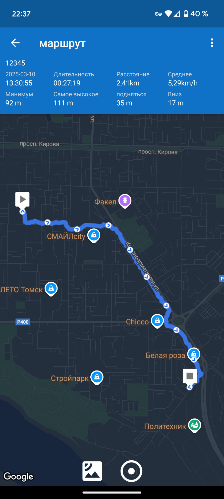
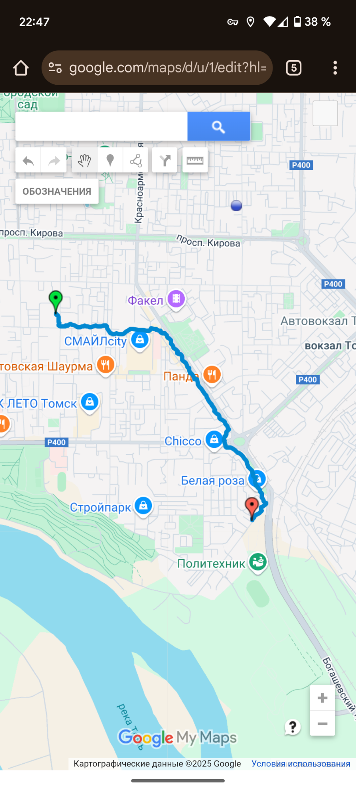
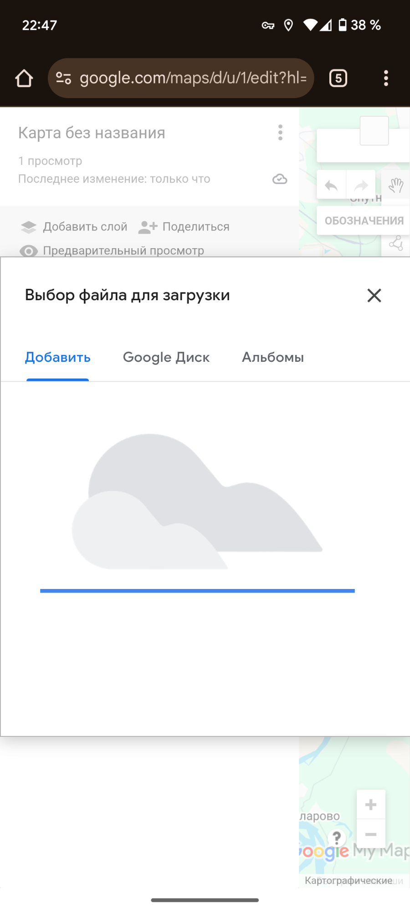

# Лабораторная работа 1

Мною было изучено приложение «Мои маршруты»[^1] и загружено на мой смартфон. При помощи смартфона Google Pixel 6a (Android 15) приложением «Мой маршрут» был записан трек моего маршрута движения. 
Данный трек, благодаря функции приложения «Экспорт», может быть доступен с других устройств. Данный трек был экспортирован на Google Диск и на импортирован на карту Google Maps[^2], которую я для этого создал. Последовательность этих действий подтверждается следующими скриншотами (рис.1 – рис. 3):

[^1]: [Описание приложения «Мой маршрут» в Google Play.](https://play.google.com/store/apps/details?id=com.zihua.android.mytracks)

[^2]: [Моя карта в Google Maps с импортированным треком моего маршрута движения и пояснениями.](https://www.google.com/maps/d/u/1/edit?mid=1CF79i9CwX3BGlaKpEQN5GcVXzwiXER8&ll=14.62869563902947%2C0&z=2)