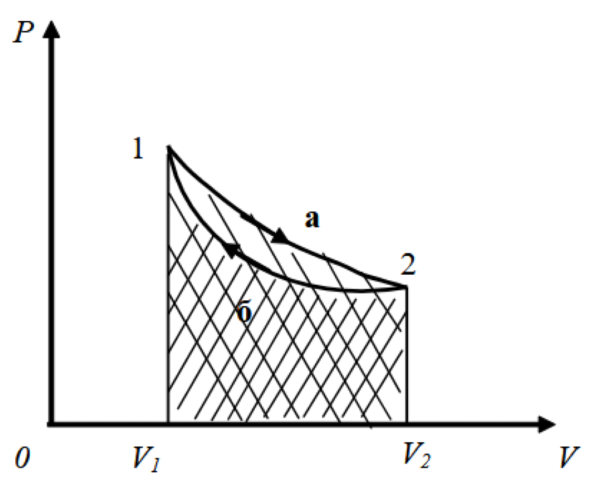
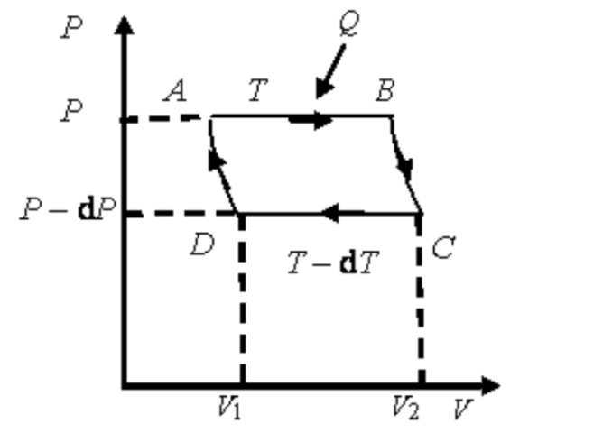

# Физика 1.8. Коллоквиум 2

## 1. Модель идеального газа.

- **Идеальный газ** - газ в котором выполнены следующие условия:
  - Молекулы идеального газа находятся на настолько больших расстояниях, что можно пренебречь их размерами.
  - Молекулы не взаимодействуют друг с другом.
- Модель идеального газа - абстракция, но многие газы близки к идеальному.
- Модель идеального газа задаётся через V, P и T (объём, давление и температуру).

## 2. Основное уравнение молекулярно-кинетической теории.

- **Основное уравнение МКТ** связывает давление идеального газа с его микроскопическими параметрами - массой и скоростью молекул.

- **Давление идеального газа P** определяется как средняя сила, с которой молекулы ударяются о стенки сосуда.

$$
P = \frac{1}{3} n m \langle v^2 \rangle
$$

где:

- $P$ - давление газа
- $n$ - концентрация молекул (число молекул на единицу объема)
- $m$ - масса одной молекулы
- **$\langle v^2 \rangle$ - среднее квадратичное значение скорости молекул**

то есть можно выразить кинетическую энергию одной молекулы как:

_TODO why_

$$
\frac{1}{2} m \langle v^2 \rangle = \frac{3}{2} k T
$$

где:

- $k = 1.380649 \times 10^{-23}$ Дж/К - постоянная Больцмана
- $T$ - температура в Кельвинах.

## 3. Уравнение состояния идеального газа (уравнение Менделеева-Клапейрона).

$$
PV = \frac{m}{\mu}RT
$$

где:

- $m$ - масса газа
- $\mu$ - масса одного моля газа
- $\frac{m}{\mu}$ - число молей газа
- $R = 8.314$ Дж/(моль∙К) - **универсальная газовая постоянная**

> Универсальная газовая постоянная $R$ равна **работе**, которую совершает 1 моль идеального газа при изобарическом расширении, если газ нагреть на один градус.

Для одного моля газа 1 $\frac{m}{\mu} = 1$ уравнение состояния идеального газа (Менделеева - Клапейрона) записывается:

$$
PV = RT
$$

## 4. Физические основы термодинамики.

- Термодинамика - это наука, изучающая условия превращения различных видов энергии в тепловую и обратно, а также количественные соотношения, наблюдаемые при этом.
- Термодинамическая система - совокупность макроскопических тел, которые обмениваются энергией как между собой, так и внешними телами (внешней средой). Часто эту совокупность рассматривают как одно целое.
- Типы систем _(?)_:
  - Открытая - обменивается веществом и энергией с окружающей средой
  - Закрытая - обменивается только энергией
  - Изолированная - не обменивается ни веществом, ни энергией
- Основные параметры состояния:
  - $P$ - давление
  - $V$ - объем
  - $T$ - температура
  - **$U$ - внутренняя энергия**
- Процессы:
  - Изотермический ($T = \text{const}$)
  - Изобарический ($P = \text{const}$)
  - Изохорический ($V = \text{const}$)
  - **Адиабатический ($Q = 0$ - нет теплообмена)**
- Функции состояния - зависят только от текущего состояния (например, $U$, $T$, $P$, $V$, энтропия $S$). В отличие от процессов, не зависят от пути перехода.
- Переход между состояниями описывается термодинамическим процессом.

## 5. Теплота, работа.

- **Теплота** - форма передачи энергии между системами из‑за разности температур.
- **Работа** - механическая энергия, переданная системе через силу, действующую на её контур $A = \int P\,dV$.
- Формулы:
  - $\delta Q > 0$ - система получает тепло.
  - $\delta A > 0$ - работа совершена над системой.

## 6. Первое начало термодинамики.

- **Внутренняя энергия $U$** является функцией состояния системы, т.е. каждому состоянию тела соответствует одно значение $U$.
- Изменение энергии $\Delta{U} = U_2-U_1$ не зависит от того, каким путём совершается переход из одного состояния в другое. Следовательно, бесконечно малое изменение $dU$ внутренней энергии является полным дифференциалом.
- Количества теплоты и работы **зависят** от пути перехода системы из начального в конечное состояние, они не являются функциями состояния системы, их бесконечно малые изменения $\delta{Q}$ и $\delta{A}$ не являются полными дифференциалами.

$$
\delta{Q} = dU + \delta{A}
$$

## 7. Теплоемкость газов (теплоёмкость идеального газа).

- **Удельная теплоёмкость $с$** - это физическая величина, равная количеству теплоты, которое необходимо сообщить единице массы этого вещества, чтобы нагреть его на один градус.
- **Молярная теплопроводность $C$** - это физическая величина, равная количеству теплоты, которое необходимо сообщить одному молю вещества, чтобы нагреть его на один градус.
- _$T$ - кельвины, а $t$ - цельсии. $T = t+273$, $\Delta{T} = \Delta{t}$_

$$
C = \mu c
$$

$$
\Delta{Q} = cm \Delta{t} = \frac{m}{\mu} C \Delta{T}
$$

## 8. 2 начало термодинамики.

- Невозможно осуществить процесс, единственным результатом которого является переход тепла от холодного тела к горячему - **Клаузиус**.
- Невозможно создать тепловой двигатель, который бы полностью превращал теплоту в работу без каких-либо изменений в окружающей среде - **Кельвин-Планк**.

то есть:

- Не вся теплота может быть превращена в работу.
- Направление процессов определяется увеличением энтропии.
- Второе начало объясняет, почему процессы идут в одном направлении (например тепло от горячего к холодному). Оно не выводится из первого начала и вводит необратимость в физику.

## 9. Обратимые и необратимые тепловые процессы, круговые процессы.

### Обратимые и необратимые тепловые процессы

- **Обратимым процессом** называется такой процесс, который может протекать как в прямом, так и в обратном направлениях, причем при протекании в обратном направлении система проходит через те же самые состояния, что и при прямом процессе. При этом ни в окружающей среде, ни в самой системе не возникает никаких остаточных изменений.
- Процессы, не удовлетворяющие условиям обратимости, называются **необратимыми**.
- **Все реальные процессы необратимы**.
- Обратимые процессы - это идеализация реальных процессов.

### Круговые процессы

- **Круговым процессом** (или циклом) называется такой процесс, в результате которого система возвращается в исходное состояние.
- Рабочим телом является идеальный газ.
- $A = A_1 - A_2$ - cуммарная работа, совершенная в результате этого цикла.
- $\eta = \frac{A}{Q_1} = \frac{Q_1-Q_2}{Q_1}$ - кпд ($Q_1$ - тепло, полученное рабочим телом от нагревателя, $Q_2$ - тепло, отданное рабочим телом холодильнику, считается отрицательным)

- $А_1 > 0$ система сама совершает работу по отношению к внешним телам (1-а-2).
- $А_2 < 0$ внешние силы совершают работу над
  системой (2-б-1).

## 10. Понятия энтропии, микросостояний и макросостояний системы.

- **Макросостояние** описывает систему в целом с помощью макроскопических параметров ( давление, объем, температура, энергия etc.). Например Газ при температуре 300 K, объеме 1 л и давлении 1 атм.
- **Микросостояние** описывает конкретную конфигурацию всех частиц системы (координаты, скорости etc.).
- Одному макросостоянию соответствует множество микросостояний.
- **Энтропия S** - мера беспорядка или вероятности состояния системы. Увеличивается при переходе к более вероятным (дезорганизованным) состояниям.

## 11. Термодинамическая вероятность состояния.

- **Термодинамическая вероятность** $W$ - это число микросостояний, соответствующих одному и тому же макросостоянию системы.
- Чем больше микросостояний соответствует данному макросостоянию, тем оно более вероятно и тем выше его энтропия.
- Система стремится к состоянию с максимальной термодинамической вероятностью (равновесию).
- Например газ, равномерно распределённый по всему объёму, имеет больше микросостояний (и, соответственно, большую вероятность), чем газ, скученный в одном углу сосуда, а значит равновесное состояние самое вероятное.

## 12. Формула Больцмана.

$$
S = k \ln{w}
$$

где:

- $S$ - энтропия
- $k$ - постоянная Больцмана
- $w$ - число микросостояний, соответствующих данному макросостоянию

то есть можно выразить $\Delta{S}$:

$$
\Delta{S} = \int_{1}^{2}{\frac{da_{12}}{T}} = \frac{m}{M} (Cv \ln{\frac{T_2}{T_1} + R \ln{\frac{V_2}{V_1}}})
$$

где:

- $Cv$ - молярная теплоёмкость при постоянном объёме. Зависит от количества степеней свободы молекулы. $\frac{n}{2}R$.
- $T_1, T_2$ - начальная и конечная температуры
- $V_1, V_2$ - начальный и конечный объёмы
- $\Delta S$ - изменение энтропии при переходе системы из состояния 1 в состояние 2
- $\int_{1}^{2}{\frac{da_{12}}{T}}$ - интеграл изменения элементарной теплоты, делённой на температуру, по обратимому пути между состояниями 1 и 2

## 13. Третье начало термодинамики (теорема Нернста).

- При абсолютном нуле температуры энтропия принимает значение $S_0$, не зависящее от давления, агрегатного состояния и других характеристик вещества. Эту величину можно принять равной нулю.
- В отличие от нулевого, первого и второго начал теорема Нернста не вводит в термодинамику новой функции состояния, однако именно она делает функции состояния численно определенными и практически полезными.
- $\lim_{T \to 0}{\Delta{S}} = 0$ - математическая форма теоремы Нернста
- $\lim_{T \to 0}{S} = 0$ - другая форма теоремы Нернста, математически эквивалентная первой.

## 14. Цикл Карно, теоремы Карно.

- **Цикл карно** - идеальный круговой процесс, состоящий из:
  1. Изотермического расширения при температуре $T_н$ - поглощение теплоты.
  2. Адиабатного расширения - без теплообмена, температура падает.
  3. Изотермического сжатия при $T_x$ - отдача теплоты.
  4. Адиабатного сжатия - температура снова возрастает до $T_н$.
- Рабочее тело цикла карно - идеальный газ.
- $\eta = 1 - \frac{T_х}{T_н} = 1- \frac{Q_н}{Q_х}$
- **Теоремы Карно**
  1. Ни одна тепловая машина, работающая между двумя температурами, не может иметь КПД выше, чем у цикла Карно.
  2. Все обратимые тепловые машины, работающие между одинаковыми температурами, имеют одинаковый КПД, равный КПД Карно.
- Все реальные двигатели менее эффективны, т.к. они необратимы.
- КПД зависит только от температур, не от рабочего тела.

- Цикл Карно состоит из двух изотерм и двух адиабат.
- Исходное состояние системы на графике PV изображается точкой А.
- Изотермически расширяясь, система переходит из состояния A в B.
  - Участок AB - прямая изотерма при температуре $T_H$.
  - Давление уменьшается, объём растёт.
  - Газ получает теплоту $Q_H$ от нагревателя и совершает работу.
- Адиабатически расширяясь, система переходит из состояния B в C.
  - Теплообмен отсутствует: $Q = 0$.
  - Газ продолжает расширяться, температура падает до $T_C$.
  - Работа совершается за счёт уменьшения внутренней энергии.
- Изотермически сжимаясь, система переходит из состояния C в D.
  - Участок CD - прямая изотерма при температуре $T_C$.
  - Газ отдаёт теплоту $Q_C$ холодильнику.
  - Давление растёт, объём уменьшается. Работа совершается над газом.
- Адиабатически сжимаясь, система переходит из состояния D в A.  
  Участок DA - адиабата.  
  Теплообмен отсутствует: $Q = 0$.  
  Газ сжимается, температура увеличивается до $T_H$.  
  Система возвращается в исходное состояние.

## 15. Распределение Максвелла и Больцмана.

### Распределение Больцмана

- **Распределение Больцмана** описывает вероятность нахождения частицы в состоянии с энергией $E$.
- Чем выше энергия $E$, тем ниже вероятность $P(E)$.

$$
P(E) = \frac{1}{Z} e^{-\frac{E}{kT}}
$$

где:

- $Z$ — статистическая сумма (нормировочный множитель)
- $k$ — постоянная Больцмана

### Распределение Максвелла по скоростям

- **Распределение Максвелла** описывает распределение молекул идеального газа по скоростям.

$$
f(v) = 4 \pi \left( \frac{m}{2\pi kT} \right)^{3/2} v^2 e^{- \frac{mv^2}{2kT}}
$$

где:

- $m$ — масса молекулы
- $v$ — скорость

характерные скорости:

- Средняя скорость: $\langle v \rangle = \sqrt{ \frac{8kT}{\pi m} }$
- Наиболее вероятная скорость (пик распределения): $v_{\text{вр}} = \sqrt{ \frac{2kT}{m} }$
- Среднеквадратичная скорость:$v_{\text{ср.кв.}} = \sqrt{ \frac{3kT}{m} }$

## 16. Явления переноса: диффузия, теплопроводность, вязкость (внутреннее трение), их уравнения и коэффициенты.

- **Явления переноса** - это процессы, при которых происходит передача вещества, энергии или импульса в веществе вследствие микроскопических движений частиц.

### Диффузия

**Диффузией $M$** называется явление самопроизвольного взаимного проникновения и перемешивания частиц двух соприкасающихся газов. Для смеси газов явление диффузии вызывается различием концентрации отдельных газов в разных частях сосуда. При постоянной температуре явление диффузии заключается в переносе массы газа из мест с большей концентрацией в места, где концентрация меньше.

$$
\Delta{M} = -D \frac{d\rho}{dx} \Delta{S} \Delta{t}
$$

где:

- $D$ — коэффициент диффузии (м²/с)
- $\rho$ — плотность вещества
- $x$ — координата вдоль направления диффузии
- $\Delta{S}$ — площадь поперечного сечения
- $\Delta{t}$ — промежуток времени

### Теплопроводность

**Теплопроводность** это передача тепловой энергии от более нагретых участков к менее нагретым.

$$
q = -\kappa \frac{dT}{dx}
$$

- $q$ — плотность теплового потока
- $\kappa$ — коэффициент теплопроводности
- $\frac{dT}{dx}$ — градиент температуры

### Вязкость

- **Вязкость газов** (это явление относится и к жидкостям) – это свойство,
  благодаря которому выравниваются скорости движения различных слоев
  газа. Выравнивание скоростей соседних слоев, если эти скорости различны,
  происходит благодаря тому, что из слоя газа с большой скоростью движения
  переносится импульс к слою, движущемуся с меньшей скоростью.

$$
\tau = \eta \frac{du}{dy}
$$

где:

- $\tau$ — напряжение сдвига (касательное напряжение)
- $\eta$ — коэффициент вязкости
- $\frac{du}{dy}$ — градиент скорости (изменение скорости вдоль направления, перпендикулярного потоку)

### Коэффиценты

- В идеальных газах коэффициенты ($D, \kappa, \eta$) можно выразить через среднюю скорость и длину свободного пробега:

$$
D \sim \lambda \bar{v}, \quad \kappa \sim \lambda \bar{v} c_v, \quad \eta \sim \lambda \bar{v} \rho
$$

## 17. Фазовые равновесия и фазовые превращения.

### Фазовые превращения

- **Термодинамической фазой** называется физически однородная часть вещества, которая по своим физическим свойствам отличается от других его частей и отделена от них поверхностью раздела.
- Пусть в закрытом сосуде имеется вода, над которой находится смесь воздуха с водяными парами. Эта система является двухфазной, она состоит из двух фаз: жидкой (вода) и газообразной (смесь воздуха с водяными парами).
- Если бы воздуха не было, то система все равно была бы двухфазной: жидкая фаза – вода и газообразная фаза – водяные пары.
- Бросим в воду кусочки льда. Система станет трехфазной: твердая фаза – лед, жидкая фаза – вода, газообразная фаза – смесь воздуха с водяными парами.
- Добавим к воде ртуть, в системе будут уже две жидкие фазы: ртуть и вода. Газообразная фаза по-прежнему одна, она состоит из смеси воздуха, паров воды и паров ртути. Итак, в системе может быть несколько жидких или твердых фаз. Но система не может содержать более одной газообразной фазы, т.к. все газы смешиваются между собой.
- Соприкасающиеся фазы могут превращаться (переходить) друг в друга.
- Переход вещества из одного фазового состояние в другое называется фазовым переходом, или **фазовым превращением**.
- Существуют следующие фазовые переходы:
  1. жидкость <-> пар;
  2. жидкость <-> твердое тело;
  3. твердое тело <-> пар.

### Фазовые равновесия

- **Фазовое равновесие** - набор условий, при которых система, состоящая из двух или нескольких фаз, находится в равновесии.
- Для равновесия необходимо:
  1. чтобы все фазы системы имели одну и ту же температуру: $T_1 = T_2 = T$;
  2. чтобы давление по разные стороны границы раздела соприкасающихся фаз было одинаково: $P_1 = P_2 = P$;
  3. чтобы массы всех фаз системы оставались неизменными, т.е. чтобы масса одной из фаз не росла за счет другой:m1=const, m2=const;
  4. $m_1 + m_2 = m = \text{const}$.

## 18. Реальные газы.

- Молекулы в **реальных газах**, в отличии от идеальных имеют собственный объём и притягиваются друг к другу на малых расстояниях.
- При высоких давлениях и низких температурах отклонения от идеального газа заметны.
- $a > 0$ снижает давление (из-за притяжения)
- $b > 0$ уменьшает доступный объём (из-за размеров молекул)

$$
\left( P + a \frac{n^2}{V^2} \right)(V - nb) = nRT
$$

Где:

- $a$ — поправка на силы притяжения между молекулами
- $b$ — поправка на собственный объём молекул
- $n$ — число молей, $V$ — объём, $T$ — температура

- Когда нельзя применять модель идеального газа:
  - При температуре близкой к точке сжижения
  - При высоких давлениях
  - Для тяжёлых молекул с сильными Ван-дер-Ваальсовыми силами

## 19. Элементы неравновесной термодинамики. _!100% AI_

- **Неравновесное состояние** — система вне термодинамического равновесия.
- **Потоки (флюксы)** $J_i$ — характеризуют движение энергии, вещества и т.д.
- **Силы (движущие)** $X_i$ — термодинамические "градиенты", вызывающие потоки.

Примеры:

- Поток теплоты: $J_q$, сила: $X_q = \nabla \left( \frac{1}{T} \right)$
- Поток массы: $J_m$, сила: $X_m = -\nabla \mu$

## 2. Энтропия в неравновесной термодинамике

Общее изменение энтропии:

$$
\frac{dS}{dt} = \left( \frac{dS}{dt} \right)_{\text{внешн}} + \left( \frac{dS}{dt} \right)_{\text{внутр}} \geq 0
$$

Где:

- Внешний вклад — из обмена с окружающей средой
- Внутренний — из-за необратимых процессов

## 3. Производство энтропии

Скорость производства энтропии:

$$
\sigma = \sum_i J_i X_i \geq 0
$$

Это скалярная величина — плотность скорости производства энтропии.

## 4. Законы ОНСАГЕРА

**Линейные связи** между потоками и силами (для малых отклонений от равновесия):

$$
J_i = \sum_j L_{ij} X_j
$$

- $L_{ij}$ — коэффициенты Онсагера
- Симметрия Онсагера: $L_{ij} = L_{ji}$ (если соблюдается микроскопическая обратимость)

## 5. Примеры кросс-эффектов

- **Термодиффузия (эффект Зеебека):**
  - Градиент температуры вызывает электрический ток
- **Диффузиотермия (эффект Дюа):**
  - Градиент концентрации вызывает тепловой поток

## 6. Условия применимости

- Слабые отклонения от равновесия
- Местное термодинамическое равновесие
- Достаточно медленные процессы
